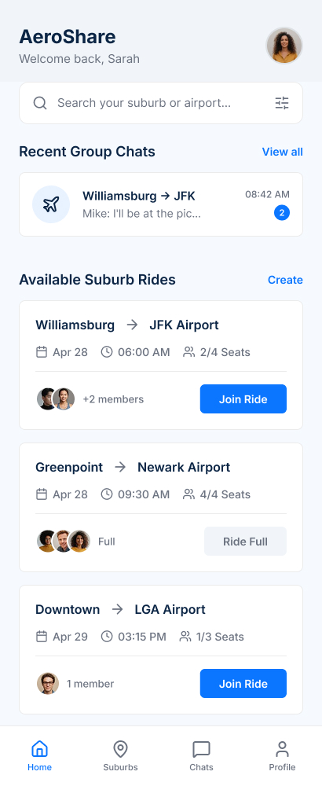
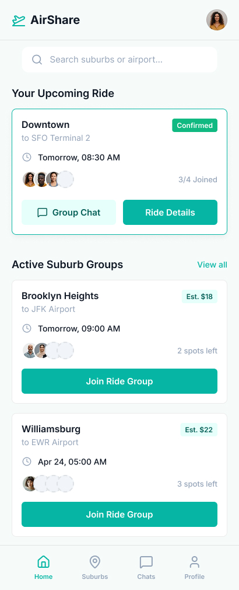
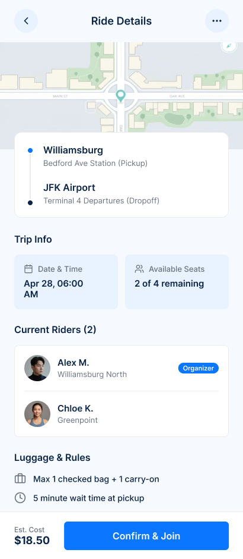
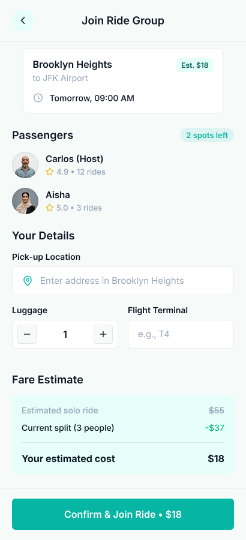

# AirportShareFigma
✈️ Airport pickups/dropoffs can be stressful. So, I designed a ride-sharing app UI to make booking faster and simpler. Designing this app made me realize how much UI simplicity affects booking decisions.

The goal of this design was to build a clean, modern, and user-friendly ride booking flow that makes airport pickups quick and intuitive.

## Both designs aim to improve the following:
- ✈️ Airport pickup/dropoff experience
- 📱 Mobile usability for travelers
- 🚗 Quick ride booking flow
- 🎯 Clear UI navigation & accessibility

Scroll more to download Figma File.

## 📸 Screenshots

| Screen 1 | Screen 2                            | Screen 3                   |
| ----------- |-------------------------------------|-------------------------------------|
|| |  |

| Screen 4 |
| ------------------------------------ |
||


👀 Which UI design would you choose for an airport ride-sharing app? Style 1 or Style 2?

🎨 Would anyone be interested in the Figma design file for this concept?

# Free Figma File: [Click here to download.](https://bit.ly/AirShareAppFigmaFile)

Your suggestions and feedback would be greatly appreciated!


## 💰 Donations

This project needs you! If you would like to support this project's further development, the creator of this project or the continuous maintenance of this project, feel free to donate. Your donation is highly appreciated (and I love food, coffee and beer). Thank you!

**PayPal**

- **[Donate \$5](https://www.paypal.me/prashantadesara/5)**: Thanks' for creating this project, here's a cup of tea (or some juice) for you!

- **[Donate \$10](https://www.paypal.me/prashantadesara/10)**: Wow, I am stunned. Let me take you to the movies!

- **[Donate \$15](https://www.paypal.me/prashantadesara/15)**: I really appreciate your work, let's grab some lunch!

- **[Donate \$25](https://www.paypal.me/prashantadesara/25)**: That's some awesome stuff you did right there, dinner is on me!

- **[Donate \$50](https://www.paypal.me/prashantadesara/50)**: I really really want to support this project, great job!

- **[Donate \$100](https://www.paypal.me/prashantadesara/100)**: You are the man! This project saved me hours (if not days) of struggle and hard work, simply awesome!

- **[Donate \$2799](https://www.paypal.me/prashantadesara/2799)**: Go buddy, buy that MacBook Pro for yourself!

  

**BuyMeACoffee**

<a href="https://www.buymeacoffee.com/bytesbee">
</a> You can support me on BuyMeACoffee too!

Of course, you can also choose what you want to donate, all donations are awesome!


## 👨 Developed By

```
** Prashant Adesara **
```

# License
```license
Copyright 2016 Prashant Adesara

Licensed under the Apache License, Version 2.0 (the "License");
you may not use this file except in compliance with the License.
You may obtain a copy of the License at

http://www.apache.org/licenses/LICENSE-2.0

Unless required by applicable law or agreed to in writing, software
distributed under the License is distributed on an "AS IS" BASIS,
WITHOUT WARRANTIES OR CONDITIONS OF ANY KIND, either express or implied.
See the License for the specific language governing permissions and
limitations under the License.
```


